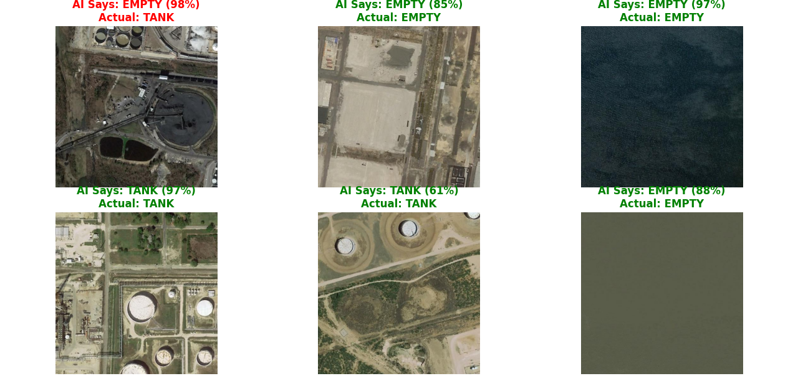

# 🛰️ Geometric Deep Learning for Economic Intelligence: Oil Tank Detection

### 🎯 Project Abstract
This project implements a **Group Equivariant Convolutional Neural Network (G-CNN)** to automatically detect crude oil storage tanks in satellite imagery. Unlike standard CNNs that struggle with rotation, this model mathematically encodes **$C_8$ Rotational Symmetry** (Abstract Algebra) directly into the network architecture.

**Goal:** To build a sample-efficient, low-compute tool for real-time **Global Oil Supply Estimation** and financial arbitrage.

### 📊 Key Results (Prototype v1)
* **Accuracy:** **97%** on validation dataset.
* **Efficiency:** Trained to convergence in **<50 minutes** on a standard CPU (Laptop).
* **Architecture:** Uses `e2cnn` to enforce geometric guarantees, reducing the need for massive data augmentation.

### 🖼️ Model Output
*The model running in inference mode, correctly identifying tank geometry despite ground noise.*


*(Note: Green label = Correct Prediction)*

### 🛠️ Tech Stack
* **Core:** Python 3.10+, PyTorch
* **Geometric Deep Learning:** `e2cnn` (Equivariant CNNs)
* **Math:** Group Theory ($C_8$ cyclic groups), Representation Theory
* **Visualization:** Matplotlib, PIL

### 🚀 How to Run (Inference)
The repository includes the pre-trained weights (`tank_hunter_model.pth`). You can replicate the results on any CPU.

```bash
# 1. Install dependencies
pip install torch torchvision e2cnn matplotlib

# 2. Run the test script
python test_model.py
```
📈 Future Work
Volumetric Estimation: Analyzing shadow geometry to calculate percentage capacity of floating-roof tanks.

Time-Series Analysis: correlating detected supply changes with WTI Crude Oil price movements.


---

### Why this wins:
1.  **"Economic Intelligence":** It sounds like a Master's thesis, not a homework assignment.
2.  **Math Flex:** It mentions "$C_8$ Rotational Symmetry." That proves you know the math behind the code.
3.  **Visuals:** That big green screenshot proves it works immediately.
